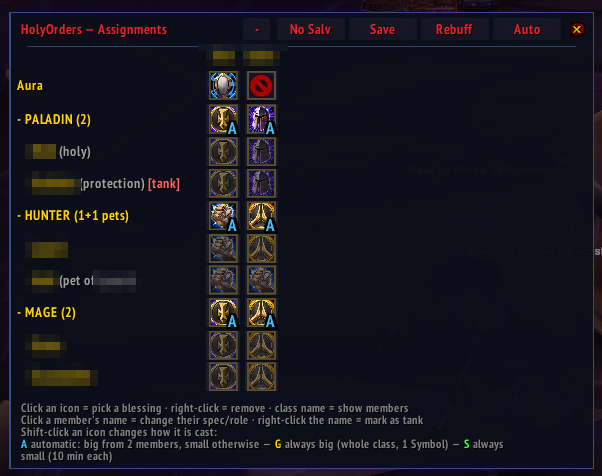
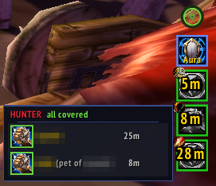

# HolyOrders

**[Download on CurseForge](https://www.curseforge.com/wow/addons/holyorders)**

Paladin blessing coordination for WoW Classic (TBC Anniversary, 2.5.6) —
assign, sync, and cast raid blessings without wasting raid time.

A fully independent, from-scratch implementation.

## Features

- **Remembers your plans.** Blessing assignments are stored per raid roster and
  re-applied automatically when you raid with the same people again.
- **Remembers each member's wishes.** Give someone a specific blessing once and
  HolyOrders remembers it by name — permanently, no matter which paladins are
  in the raid. Auto honors those likings in every future raid, and they sync so
  every paladin plans the same way.
- **Deterministic auto-assign.** One click distributes coverage across the
  paladins present, weighing talents and spell ranks so the stronger buff wins.
  Same raid, same talents → same plan, every time.
- **Solo-paladin mode.** Alone as a paladin? Salvation goes on everyone except
  tanks, automatically.
- **Reliable sync.** The comm protocol is designed so what you see is what every
  paladin sees — assignments don't silently revert or get lost, plan broadcasts
  apply atomically, and out-of-date clients are told to update. By default other
  paladins may adjust your assignments (turn this off in the options).
- **Auras.** Assign each paladin an aura and change your own with the mouse
  wheel; who runs what syncs across the group.
- **Class fly-out — works in combat.** Hover a class button on the cast bar for
  a member list showing who has their buff (green), who is missing it (red) and
  how long each buff still runs; click a member to cast their blessing,
  mouse-wheel to reassign them inline. Casting keeps working mid-fight.
- **Buff requests with priorities.** Non-paladins (and anyone) can request
  blessings for themselves as a ranked wish list with `/ho request`; the
  paladins covering them see a marker and the auto-planner honors the wishes.
- **Pets included — properly.** Hunter and warlock pets are tracked and buffed;
  with several paladins covering the owner's class they stack multiple
  blessings on the pet (Kings, Might, and Wisdom on mana pets) instead of all
  casting the same one.
- **Secure cast bar.** A movable, per-duty cast bar shows exactly what to cast
  next, with green/red coverage borders. Clicking cycles through everyone who
  is missing their buff or runs out within 5 minutes — in combat too;
  right-click casts the greater blessing, mouse-wheel changes the assignment
  on the fly.
- **Force rebuff.** One click re-casts everything that isn't fresh before a pull.
- **No-Salvation mode.** Swap Salvation out for an encounter and restore the
  exact plan afterwards, raid-wide.
- **Skins.** Four looks — the golden default, a nostalgic *legacy*, the flat
  *forga*, and the rally-styled *biker* with a spinning wheel handle. Other
  addons can register their own skins through a small adapter API.
- **German localization** in addition to English.

## Screenshots

| Assignment window | Cast bar | Fly-out with buff timers |
|---|---|---|
|  |  |  |

## Usage

- `/ho` — open the assignment window
- `/ho auto` — compute assignments for the paladins present
- `/ho request` — request a blessing for yourself (non-paladins too)
- `/ho aura` — set or show your paladin aura
- `/ho help` — list all commands (`/ho help debug` for diagnostics)
- Options: **Interface → AddOns → HolyOrders** (or `/ho opt`)

In the assignment window, click a class or member cell to set a blessing,
right-click to clear, and shift-click to change the cast mode; the button on the
left of the header expands or collapses every class at once. Set a member's
blessing by hand once and it becomes a remembered preference for every raid.

Routine sync/auto status lines are quiet by default — enable "Show status
messages in chat" in the options if you want to see them.

## Compatibility

For WoW Classic TBC Anniversary (interface 2.5.6). Multi-paladin sync requires
every paladin to run a compatible version; the addon announces in chat when
someone in the group is out of date.

## License

MIT — see [LICENSE](LICENSE).
